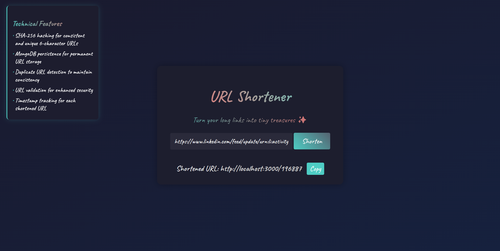

# URL Shortener

A simple URL shortener built with Node.js, Express, and MongoDB.

## Features
- Shorten long URLs using SHA-256 hashing (6-character hash)
- Persistent storage with MongoDB
- Prevents duplicate URL entries
- URL validation for security
- Timestamp tracking for each shortened URL

## Installation
1. Clone the repository:
   ```sh
   git clone https://github.com/mostafa-mahmood/Url-Shortener.git
   ```
2. Install dependencies:
   ```sh
   npm install
   ```
3. Set up a `.env` file with the following variables:
   ```env
   MONGO_URI=your_mongodb_connection_string
   PORT=3000
   DOMAIN=localhost
   ```
4. Start the server:
   ```sh
   npm start
   ```

## Preview
